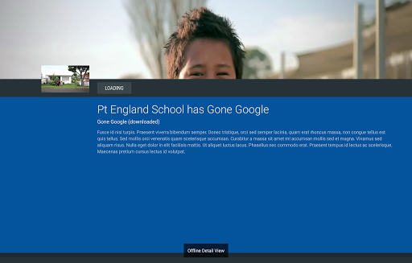
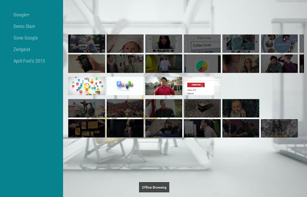
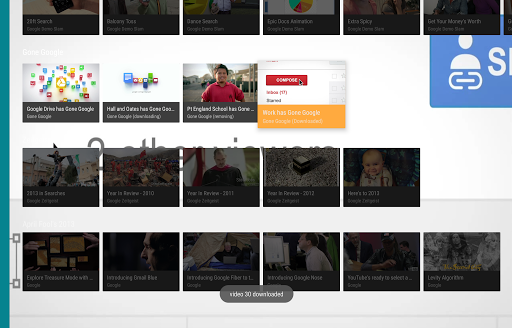
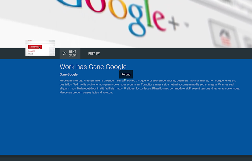
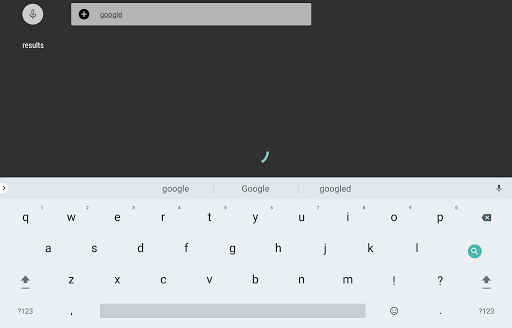
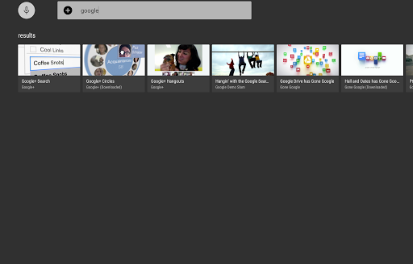

# Room Component Design Spec

## Overview 

This app is used to demonstrate how to persist data to local database or sd card (based on the data type). To make the tv app ready for offline use.

In our sample app, we use [Room Database](https://developer.android.com/topic/libraries/architecture/room.html) as the database and ui controller will observe the database's status leveraging [LiveData](https://developer.android.com/topic/libraries/architecture/livedata.html) and [ViewModel](https://developer.android.com/topic/libraries/architecture/viewmodel.html) to update the ui automatically and reactively once the data source in the database is changed.

To be more specific, when the app is firstly launched under network available environment, it will fetch and persist the json data (including video's title, video's URL) to room database. So when the network is unavailable, user still can view some basic information like videos' categories, video's name etc. 

To enable full offline use, in our app user can long click the video item to download the selected video's media data (video content, background and card image) through the pop up menu. Once it is downloaded, the paths point to those local contents will be updated to the database.

## Technical Details
Firstly, regarding the interaction with database, the query result from [Room Database](https://developer.android.com/topic/libraries/architecture/room.html) is represented as [LiveData](https://developer.android.com/topic/libraries/architecture/livedata.html) and captured inside of a [ViewModel](https://developer.android.com/topic/libraries/architecture/viewmodel.html). So the data can survive though the configuration changes as long as the Life cycle owner is not destroyed.

Also through leveraging [MediatorLiveData](https://developer.android.com/reference/android/arch/lifecycle/MediatorLiveData.html) we can return the query result from database with specified delay. The delay is designed to simulate two scenarios. 1. Fetching data from Internet. Since the [LiveData](https://developer.android.com/topic/libraries/architecture/livedata.html) and [ViewModel](https://developer.android.com/topic/libraries/architecture/viewmodel.html) is independent from the room database, any data type can be encapsulated to [LiveData](https://developer.android.com/topic/libraries/architecture/livedata.html). So it perfectly simulate the scenario when network environment is the bottleneck. 2. Accessing Massive database. In this app, the dataset is relatively small, but the actual database can be huge. In that case, the delay for querying operation is unavoidable. In sum, through introducing the delay to access the database, it can help us scale our application and deal with lots of common challenges like frequent network requesting. 

The adoption of [LiveData](https://developer.android.com/topic/libraries/architecture/livedata.html) enables the whole reactive architecture. For example, network connectivity status is represented using a [LiveData](https://developer.android.com/topic/libraries/architecture/livedata.html), through observing it. Our application can react the network status change immediately by showing a text view field to tell user current network status.

Another benefits by using [LiveData](https://developer.android.com/topic/libraries/architecture/livedata.html) is the Application's state can be shared with differerent UI components easily. In this application, since the video can be downloaded/ removed/ rented, each video can have 6 different states from this perspective. Since the state change will be persist in database. Differnt ui controller (presenter/ details fragment) can observe the same data source and update the UI reactivly.   

Also to update LiveData effectively, a new adapter is created which uses DiffUtil to compute which item in the list should be updated and dispatch the change.

## key features

1. Automatically re-fetching data when network is available.

   If the database has not been created, our application will try to create it immediately once the network is available. 

2. Simulate Cache

   When the application is transiting from the overview page to detail view page, we will assemble the data shown in browsing page as a bundle to second activity. So the detail view will render the information from this bundle firstly then go to database to fetch the content through video id with specified 2s delay.

   Then another database request will be fired up to fetch the vidoes in the same category and add them to related row.

3. Reactive Search

   The search result will be changed reactively according to user's input and the result will be emitted with 2s specified delay.

## screen shots

### React to network status. 

### Sharing States

### Searching Videos

